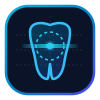

# 🩻 SURGCT — Surgical CBCT & AI Implant Analytics

[](LICENSE)
[](https://reactjs.org/)
[](https://www.typescriptlang.org/)
[](https://ai.google.dev/)

**📖 [API reference](API.md)** — full component props, imperative ref, and `/core` exports. **Documentation:**

🇬🇧 [English](lang/README-en.md) · 🇩🇪 [Deutsch](lang/README-de.md) · 🇪🇸 [Español](lang/README-es.md) · 🇭🇺 [Magyar](lang/README-hu.md)

<p align="center">
  
</p>

**SURGCT** is a next-generation **surgical dental CBCT / CT DICOM viewer** and **AI-powered diagnostic suite** for **React + TypeScript**. Load several CTs at once and switch between them; MPR and true-**3D** views (with render presets, colormaps and a low/medium/high quality control), **panoramic (OPG)** reconstruction along the dental arch, perpendicular **cross-sections**, **guided implant planning** with nerve/sinus/neighbour **safety clearances** and **bone quality** (Misch D1–D5), a **printable drill-guide (STL)** export, **Gemini AI Dental Assistant** for automated metrics and tooth localization, and configurable **image (PNG/JPG)** and **PDF report** exports — all in a 4-language UI (EN/DE/ES/HU). Everything runs **locally in the browser — private with zero upload**. Built on [Cornerstone3D](https://www.cornerstonejs.org/), [vtk.js](https://kitware.github.io/vtk.js/), and Google Gemini AI.

---

## 📦 Features

- 🔬 **Multi-Planar Reconstruction (MPR)**: Axial, Sagittal, Coronal with real-time synchronized crosshairs and window/leveling.
- 🧊 **3D Volume Rendering**: GPU-accelerated raycasting with dental presets (Bone, Hard Tissue, Soft Tissue, MIP).
- 🦷 **Panoramic (OPG) Arch Reconstruction**: Interactive spline arch curve with perpendicular resliced cross-sections.
- 📐 **Guided Implant Surgery**: Virtual 3D implant placement with IAN nerve canal tracing, maxillary sinus clearance alerts, Misch bone density mapping, and STL drill-guide generation.
- 🤖 **Gemini AI Radiologist & Dental Assistant**: Hardcoded clinical prompt engine providing automated dentition mapping (FDI/Universal), alveolar bone width/height metrics, cortical thickness, and surgical protocols.
- 📑 **Comprehensive Reporting**: Multi-page PDF clinical implant reports and high-resolution snapshot exports.

---

## 🚀 Quick start

```tsx
import { DicomViewer } from "./src";
import "./src/index.css";

export function Planner() {
  return (
    <div style={{ height: "100vh" }}>
      <DicomViewer lang="en" />
    </div>
  );
}
```

## 📄 License

MIT License. Designed for clinical research, education, and surgical planning demonstration.
